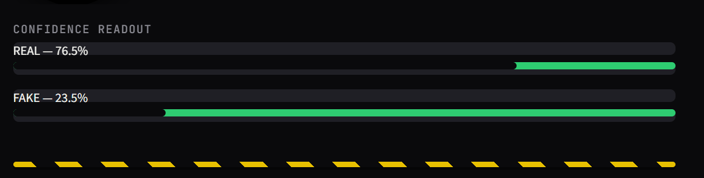
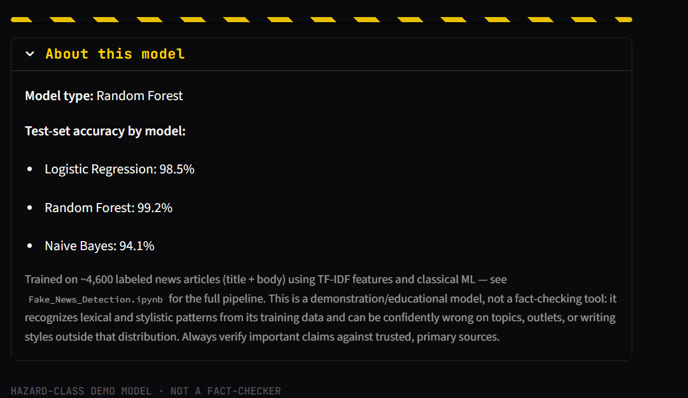

#  Fake News Detection System

A Machine Learning and Natural Language Processing (NLP) project that classifies news articles as **REAL** or **FAKE**. The system preprocesses news text, extracts TF-IDF features, compares multiple machine learning algorithms, automatically selects the best-performing classifier, and provides real-time predictions through a **Streamlit web application**.

---

#  Features

- Detects whether a news article is **REAL** or **FAKE**
- Text preprocessing using NLTK
- TF-IDF feature extraction
- Compares multiple machine learning models
- Automatically selects the best-performing classifier
- Displays prediction confidence scores
- Interactive Streamlit web interface
- Automatically downloads the dataset from Google Drive
- Saves trained model and vectorizer for deployment

---

#  Model Performance

| Model | Accuracy |
|-------|:--------:|
| **Logistic Regression (Best)** | **92.5%** |
| Random Forest | 92.1% |
| Multinomial Naive Bayes | 88.7% |

The highest-performing model is automatically selected and saved for deployment.

---

# 📷 Application Screenshots

## Home Page

<p align="center">

</p>

---

## Prediction Result

<p align="center">

</p>

---

## Confidence Scores

<p align="center">

</p>

---

## About Model

<p align="center">

</p>

---

#  Project Structure

```text
fake_news_project/
│
├── images/
│   ├── home.png
│   ├── prediction.png
│   ├── confidence.png
│   └── about_model.png
│
├── model/
│   ├── model.pkl
│   ├── vectorizer.pkl
│   └── metadata.json
│
├── preprocess.py
├── train_model.py
├── app.py
├── Fake_News_Detection.ipynb
├── requirements.txt
└── README.md
```

---

#  Dataset

This project uses the **Fake and Real News Dataset** by **clmentbisaillon**.

The dataset is hosted on **Google Drive** and is automatically downloaded during training.

## Google Drive Files

### True.csv

https://drive.google.com/file/d/1rZxZPAuoQ7ukDeA5ulaFWgdGVpedRyTF/view?usp=sharing

### Fake.csv

https://drive.google.com/file/d/1ALtLztvS1HqSXow1Es5dmXIc9HhcLbnf/view?usp=sharing

### Direct Download Links Used by the Code

True.csv

https://drive.google.com/uc?export=download&id=1rZxZPAuoQ7ukDeA5ulaFWgdGVpedRyTF

Fake.csv

https://drive.google.com/uc?export=download&id=1ALtLztvS1HqSXow1Es5dmXIc9HhcLbnf

---

# ⚙️ Installation

Clone the repository

```bash
git clone https://github.com/yourusername/fake-news-detection.git
```

Navigate into the project

```bash
cd fake-news-detection
```

Install dependencies

```bash
pip install -r requirements.txt
```

---

#  Required Libraries

- Python 3.10+
- Pandas
- NumPy
- Scikit-learn
- NLTK
- Joblib
- Streamlit
- gdown
- JSON

---

#  Training the Model

Run

```bash
python train_model.py
```

or open

```text
Fake_News_Detection.ipynb
```

The training pipeline automatically:

- Downloads the dataset from Google Drive
- Loads True.csv and Fake.csv
- Assigns REAL and FAKE labels
- Removes publisher-specific label leakage
- Cleans and preprocesses text
- Generates TF-IDF features
- Trains multiple machine learning models
- Evaluates each classifier
- Saves the best-performing model

Generated files

```text
model/
├── model.pkl
├── vectorizer.pkl
└── metadata.json
```

---

#  Running the Application

Launch Streamlit

```bash
streamlit run app.py
```

The application allows users to

- Paste a news headline
- Paste an entire article
- Predict REAL or FAKE news
- View prediction confidence
- View the best-performing model
- View model accuracy information

---

#  Machine Learning Pipeline

## 1. Dataset Loading

The application downloads

- True.csv
- Fake.csv

from Google Drive.

The datasets are combined after assigning REAL and FAKE labels.

---

## 2. Source Leakage Removal

Many genuine news articles begin with publisher datelines such as

```
WASHINGTON (Reuters) -
```

To reduce dataset bias, the preprocessing pipeline removes

- Reuters datelines
- AP datelines
- AFP datelines
- Mentions of Reuters

This encourages the model to learn writing patterns instead of publisher identities.

---

## 3. Text Preprocessing

The preprocessing pipeline performs

- Lowercase conversion
- URL removal
- HTML tag removal
- Punctuation removal
- Tokenization
- Stopword removal

The same preprocessing function is used during training and prediction.

---

## 4. Feature Extraction

TF-IDF Vectorization

Configuration

- Maximum Features: **5000**
- Unigrams
- Bigrams
- Minimum Document Frequency: **2**

---

## 5. Machine Learning Models

The following classifiers are trained

- Logistic Regression
- Random Forest
- Multinomial Naive Bayes

The model with the highest accuracy is automatically selected and saved.

---

#  Technologies Used

- Python
- Pandas
- NumPy
- Scikit-learn
- NLTK
- Streamlit
- Joblib
- gdown
- JSON
- Jupyter Notebook

---

#  Saved Files

| File | Description |
|------|-------------|
| model.pkl | Best-performing trained classifier |
| vectorizer.pkl | Trained TF-IDF vectorizer |
| metadata.json | Best model name and evaluation results |

---

#  Limitations

This project is intended for educational and portfolio purposes.

The model predicts whether an article resembles previously seen REAL or FAKE news based on learned language patterns. It does **not** verify factual claims using external fact-checking services.

Performance may decrease on

- Breaking news
- Emerging topics
- New publishers
- Different writing styles
- Articles outside the training distribution

Predictions should be treated as probabilistic estimates rather than factual verification.

---

# 🚀 Future Improvements

Possible future enhancements include

- BERT
- DistilBERT
- RoBERTa
- Explainable AI (LIME & SHAP)
- Real-time fact-checking APIs
- Publisher credibility analysis
- Author metadata
- Continuous model retraining
- News source reliability scoring

---

#  Submitted By

**Minahil Aftab**
e

---

# 📄 License

This project is intended for educational and academic purposes.
